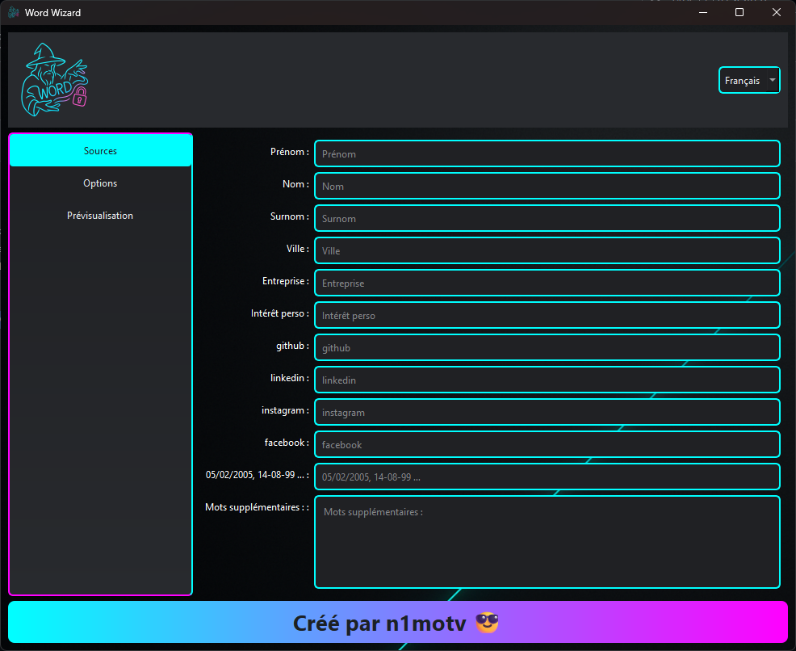

# Word Wizard — générateur de wordlists (pentest éthique)

**Version : v0.1**  
**Licence : GPL-3.0**  
**Auteur : n1motv 😎**

Word Wizard est une application **PyQt6** qui aide les pentesters et équipes Blue/Red à générer rapidement des wordlists **contextuelles** pour l’audit de mots de passe — avec export **natif Hashcat/John**.

<p align="center">
  
</p>

> ⚠️ **Utilisation éthique uniquement.** N’utilisez ce logiciel que sur des systèmes pour lesquels vous avez une autorisation écrite et explicite. L’auteur et les contributeurs ne sauraient être tenus responsables d’un usage illégal.

---

## ✨ Fonctionnalités

- **Enrichisseur doux** (optionnel)  
  Synonymes & lemmes via **NLTK WordNet**, translitération via **Unidecode** (accents → ASCII), **variantes & diminutifs** (chargées depuis `assets/variants.json`, avec fallback interne).  
  → Case **« Ajouter variantes »** dans l’onglet Options.

- **Mode bancaire (numérique pur)**  
  Génère uniquement des combinaisons **chiffrées** avec un alphabet extrait **des mots ET des dates** fournies (ex. années de naissance).

- **Capitalisation par token**  
  `hello_world` → `Hello_World`, `jean-pierre` → `Jean-Pierre`.

- **Exports natifs pour l’audit**  
  - **.hcmask** (Hashcat) à partir des modèles dérivés de la liste affichée.  
  - **.rule** (Hashcat/John) pour capitalisation, leet et suffixes.  
  - **basewords.txt + rules** (séparés) pour un workflow « génération → audit » propre.

- **Génération riche**  
  Combinaisons contrôlées (avec/sans séparateurs), mutations (leet, casse, duplication voyelles, inversion, pré/suffixes).

- **I18N & UI**  
  Interface multilingue (JSON dans `assets/lang/`), recherche en direct, copie presse‑papiers, export `.txt` ou `.gz`.

---

## 🗂️ Structure recommandée du dépôt

```
word-wizard/
├─ word_wizard.py
├─ requirements.txt
├─ README.md
└─ assets/
   ├─ logo.png
   ├─ logo.ico              # pour l'EXE Windows
   ├─ background.png
   ├─ variants.json         # (optionnel) variantes prénoms/diminutifs
   └─ lang/
      ├─ fr.json
      ├─ en.json
      └─ ...
```

> `assets/variants.json` est **optionnel** : si absent, un petit dictionnaire **fallback** embarqué sera utilisé.

---

## 🧰 Prérequis

- **Python 3.10+**
- **pip**, **virtualenv** (recommandé)
- **Windows / macOS / Linux** pris en charge

### Installer les dépendances

```bash
# création d'un venv (recommandé)
python -m venv .venv
# Windows: .venv\Scripts\activate
# Linux/macOS: source .venv/bin/activate

pip install -r requirements.txt
```

Contenu de `requirements.txt` :

```txt
PyQt6>=6.5
beautifulsoup4>=4.12
requests>=2.31
Unidecode>=1.3
nltk>=3.8
# lxml>=4.9   # (optionnel) parser HTML plus rapide pour bs4
```

### Télécharger les données NLTK (WordNet)

```bash
python -c "import nltk; nltk.download('wordnet'); nltk.download('omw-1.4')"
```

> Sans ces corpus, la partie « synonymes/lemmes » sera simplement ignorée au runtime (l’app continue de fonctionner).

---

## ▶️ Lancer l’application en dev

```bash
python word_wizard.py
```
<p align="center">
  
</p>

---

## 🧭 Utilisation

### 1) **Sources**
Renseignez les champs (prénoms, ville, intérêts, handles sociaux, etc.).  
Vous pouvez ajouter des **dates** (CSV, ex. `12/08/1996, 2001-09-11`) et des **mots libres** (zone « Mots additionnels »).

### 2) **Options**
- **Type de compte** : applique des presets (longueurs, mutateurs) adaptés.
- **Mode bancaire** : choisir **« Bank Account »** active un mode **numérique uniquement**.  
  Règle **Exact digits** = longueur précise (le set de chiffres vient des **mots** + **dates**).
- **Ajouter variantes** *(Enrichisseur doux)* :  
  ajoute synonymes/lemmes (WordNet), translitérations (Unidecode), variantes/diminutifs (`assets/variants.json`).
- Autres cases : **leet**, **casse**, **séparateurs**, **duplication voyelles**, **inversion**, **Cap. première/dernière**, **pré/suffixes**.

### 3) **Prévisualisation**
- Cliquez **Générer** pour produire la liste.
- Filtrez par **force estimée** (weak/fair/strong) et via la **barre de recherche**.
- **Exporter** :
  - **Liste** (`.txt` / `.gz`)
  - **Règles** (`.rule`) : Hashcat **ou** John, selon le sélecteur.
  - **Masques** (`.hcmask`) : modèles inférés à partir de la liste affichée.
  - **basewords + rules** : crée `basewords.txt` + `hashcat.rule` ou `john.rule`.

---

## 📤 Formats d’export & workflow d’audit (éthique)

- **`basewords.txt`** : mots « de base » (dates + champs + enrichissements) **sans combinaisons**.
- **`hashcat.rule` / `john.rule`** : règles correspondant aux options activées (capitalisation, leet, suffixes).
- **`masks.hcmask`** : masques Hashcat (ex. `?u?l?l?l?d?d`).

> Exemples **à utiliser seulement en environnement autorisé** :
>
> - **Hashcat** (règles)  
>   `hashcat -a 0 -r hashcat.rule -w 3 -O -m <hash_type> hashes.txt basewords.txt`
>
> - **John the Ripper** (règles)  
>   `john --wordlist=basewords.txt --rules=wordlist hashes.txt`

---

## 🌐 Traductions (I18N)

Les libellés sont dans `assets/lang/<code>.json`.  
Clés récemment ajoutées :
- `add_variants` — **Ajouter variantes (synonymes/translit/diminutifs)**
- `export_masks` — **Exporter masques (.hcmask)**
- `export_rule` — **Exporter .rule**
- `export_bwr` — **Exporter basewords + rules**
- `rule_style` — **Style de règles**
- Et aussi : `copied`, `copied_to_clipboard`, `search_placeholder`, `created_by`, etc.

> Si une clé manque dans une langue, l’app affichera la **clé** elle‑même (fallback).

---

## 🧱 Construction d’un exécutable (Windows)

La commande ci‑dessous packe l’app en **un seul .exe** avec toutes les dépendances utiles :

```powershell
py -m PyInstaller "word_wizard.py" `
  --onefile `
  --name "Word Wizard" `
  --add-data "assets;assets" `
  --collect-all pyqt6 `
  --collect-all unidecode `
  --collect-all nltk `
  --collect-all requests `
  --collect-all bs4 `
  --icon "assets\logo.ico" `
  --noconsole `
  --noconfirm
```

**Notes :**
- `--add-data "assets;assets"` est **Windows**‑spécifique (`;`).  
  Sur **Linux/macOS**, utilisez `:` → `--add-data "assets:assets"`.
- `--collect-all nltk` inclut le code NLTK, mais pas forcément **les corpus**.  
  Si vous voulez un **EXE offline** avec WordNet embarqué :
  1) Téléchargez les corpus localement (`nltk.download(...)`).  
  2) Copiez le dossier `~/nltk_data/` dans `assets/nltk_data/`.  
  3) Ajoutez :  
     - Windows : `--add-data "assets\nltk_data;nltk_data"`  
     - Linux/macOS : `--add-data "assets/nltk_data:nltk_data"`
- Le binaire final se trouve dans `dist/Word Wizard.exe`.

### macOS / Linux (binaire)

Commande équivalente (adapter l’icône si besoin) :

```bash
python3 -m PyInstaller word_wizard.py   --onefile   --name "Word Wizard"   --add-data "assets:assets"   --collect-all pyqt6   --collect-all unidecode   --collect-all nltk   --collect-all requests   --collect-all bs4   --icon assets/logo.icns   --noconsole   --noconfirm
```

> macOS : signature/notarisation peuvent être nécessaires selon la politique Gatekeeper.

---

## 🔧 `assets/variants.json` (optionnel)

Fichier JSON de variantes/diminutifs de prénoms. Exemple :

```json
{
  "alex": ["alexis","alexandre","aleks","alec","sasha","lex","aleksei","alexy"],
  "mohamed": ["mohammad","muhammad","mohammed","mehdi","hamid","hamoud"]
}
```

Les clés et valeurs sont **insensibles à la casse** (elles seront normalisées).

---

## 🛠️ Dépannage

- **Erreur Qt platform plugin** (Linux)  
  Installez les dépendances XCB (ex. Debian/Ubuntu) :  
  `sudo apt-get install libxcb-xinerama0 libxcb-cursor0 libxkbcommon-x11-0`

- **NLTK : WordNet non trouvé**  
  (Au premier lancement dans un environnement offline)  
  Lancez :  
  `python -c "import nltk; nltk.download('wordnet'); nltk.download('omw-1.4')"`

- **EXE se lance mais rien ne s’affiche**  
  Rebuild sans `--noconsole` pour voir les logs, ou lancez `python word_wizard.py` dans un terminal pour remonter la stacktrace.

- **Les boutons d’export sont gris**  
  Il faut **générer** une liste d’abord (bouton **Générer**).

---

## 🔐 Éthique & conformité

Ce logiciel vise à **améliorer l’hygiène des mots de passe** et à faciliter des **tests d’intrusion autorisés**.  
Assurez‑vous de disposer des **autorisations** nécessaires et de respecter la législation locale.

---

## 📜 Licence

GPL-3.0 — Voir le fichier `LICENSE`.

---

## 🙌 Crédits

- GUI : **PyQt6**  
- NLP : **NLTK (WordNet)**  
- Translittération : **Unidecode**  
- HTML parsing : **BeautifulSoup** (prévu pour extensions OSINT légères)

---

## 🗓️ Changelog (extrait)

- **v0.1** :
  - Enrichisseur doux (WordNet, Unidecode, variantes/diminutifs).
  - Mode bancaire : chiffres issus de **mots + dates**.
  - Capitalisation par **token**.
  - Exports **Hashcat/John** : `.hcmask`, `.rule`, `basewords + rules`.
  - I18N consolidé, recherche, copie, export `.gz`.
